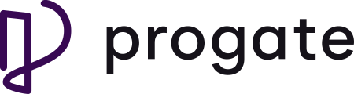

 

  

 

  <a href="https://progate.com/">Progate</a> adalah sebuah platform belajar online yang fokus pada pengembangan keterampilan dalam bidang teknologi. Platform ini menyediakan kursus interaktif dengan konten yang mudah dipahami, serta proyek nyata yang dapat membantu para pengguna mempraktikkan dan mengaplikasikan pengetahuan yang mereka pelajari.

Progate menawarkan berbagai kursus yang mencakup berbagai topik, termasuk pemrograman web, pemrograman mobile, desain grafis, pengembangan game, dan masih banyak lagi. Kursus-kursus tersebut dirancang untuk memenuhi kebutuhan pemula hingga tingkat menengah, dengan penekanan pada pendekatan praktis dan pengalaman langsung.

Salah satu keunggulan Progate adalah antarmuka belajar yang ramah pengguna, dengan kombinasi materi teori, latihan interaktif, serta proyek-proyek yang dapat langsung diterapkan. Selain itu, terdapat fitur diskusi dan dukungan komunitas yang memungkinkan pengguna berinteraksi dan bertukar informasi dengan sesama peserta kursus.

Progate tersedia dalam beberapa bahasa, termasuk bahasa Indonesia, sehingga memudahkan pengguna yang ingin belajar dalam bahasa ibu mereka sendiri. Platform ini juga menawarkan pilihan berlangganan dengan akses ke konten premium, serta sertifikat untuk menandai keberhasilan menyelesaikan kursus.

Dalam beberapa tahun terakhir, Progate telah menjadi populer di kalangan mereka yang tertarik untuk belajar pemrograman dan teknologi. Platform ini membantu ribuan orang memperoleh keterampilan yang diperlukan untuk mengikuti karir di bidang IT dan memperluas pemahaman mereka tentang dunia digital..

